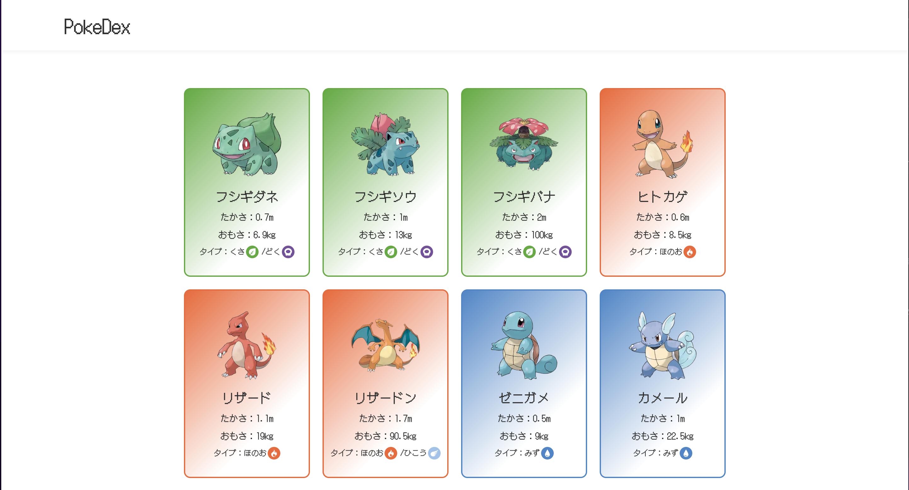

# Welcome to My PokéDex Project



## Project Overview

This project aims to create a PokéDex using modern web technologies. It's built with Next.js, React, and TypeScript. We make use of the [PokéAPI](https://pokeapi.co/) to fetch Pokémon data. The project also incorporates [Recoil](https://recoiljs.org/) for state management. Pokémon type icons are sourced from [pokemon-type-svg-icons](https://github.com/duiker101/pokemon-type-svg-icons).

**Note: This project is still under development, but feel free to clone and check it out!**

## Future Implementations

- Pokémon Detail Modal
- Search Bar
- Responsive design
- Accessibility

## System Requirements

- [Node version v20.3.1](https://nodejs.org/dist/v20.3.1/): https://nodejs.org/dist/v20.3.1/
- [TypeScript](https://www.typescriptlang.org/): https://www.typescriptlang.org/
- [Next.js](https://nextjs.org/): https://nextjs.org/
- [React](https://reactjs.org/): https://reactjs.org/
- [Recoil](https://recoiljs.org/): https://recoiljs.org/
- [yarn](https://yarnpkg.com/): https://yarnpkg.com/

## Installation and Usage

To run this project locally, first clone the repository. Then, execute the following commands:

```
yarn install
yarn dev
```

Open [http://localhost:3000](http://localhost:3000) with your browser to see the result.

# ポケモン図鑑プロジェクトへようこそ！

## プロジェクトの概要

このプロジェクトは、最新のウェブテクノロジーを用いてポケモン図鑑を作成することを目的としています。Next.js、React、および TypeScript を使用して構築されています。[PokéAPI](https://pokeapi.co/)を用いてポケモンのデータを取得しています。状態管理には[Recoil](https://recoiljs.org/)を使用しています。ポケモンのタイプのアイコンは [pokemon-type-svg-icons](https://github.com/duiker101/pokemon-type-svg-icons)から取得しています。

**注意：このプロジェクトはまだ開発中ですが、クローンして確認していただけます！**

## 今後の実装予定

- ポケモン詳細モーダルの実装
- サーチバーの実装
- レスポンシブデザイン
- アクセシビリティ

## 動作環境

- [Node version v18.16.1](https://nodejs.org/dist/v18.16.1/): https://nodejs.org/dist/v18.16.1/
- [TypeScript](https://www.typescriptlang.org/): https://www.typescriptlang.org/
- [Next.js](https://nextjs.org/): https://nextjs.org/
- [React](https://reactjs.org/): https://reactjs.org/
- [Recoil](https://recoiljs.org/): https://recoiljs.org/
- [yarn](https://yarnpkg.com/): https://yarnpkg.com/

## インストールと使用方法

このプロジェクトをローカルで動作させるには、まずリポジトリをクローンします。その後、以下のコマンドを実行してください。

```
yarn install
yarn dev
```

ブラウザで [http://localhost:3000](http://localhost:3000) を開くと、結果が表示されます。
