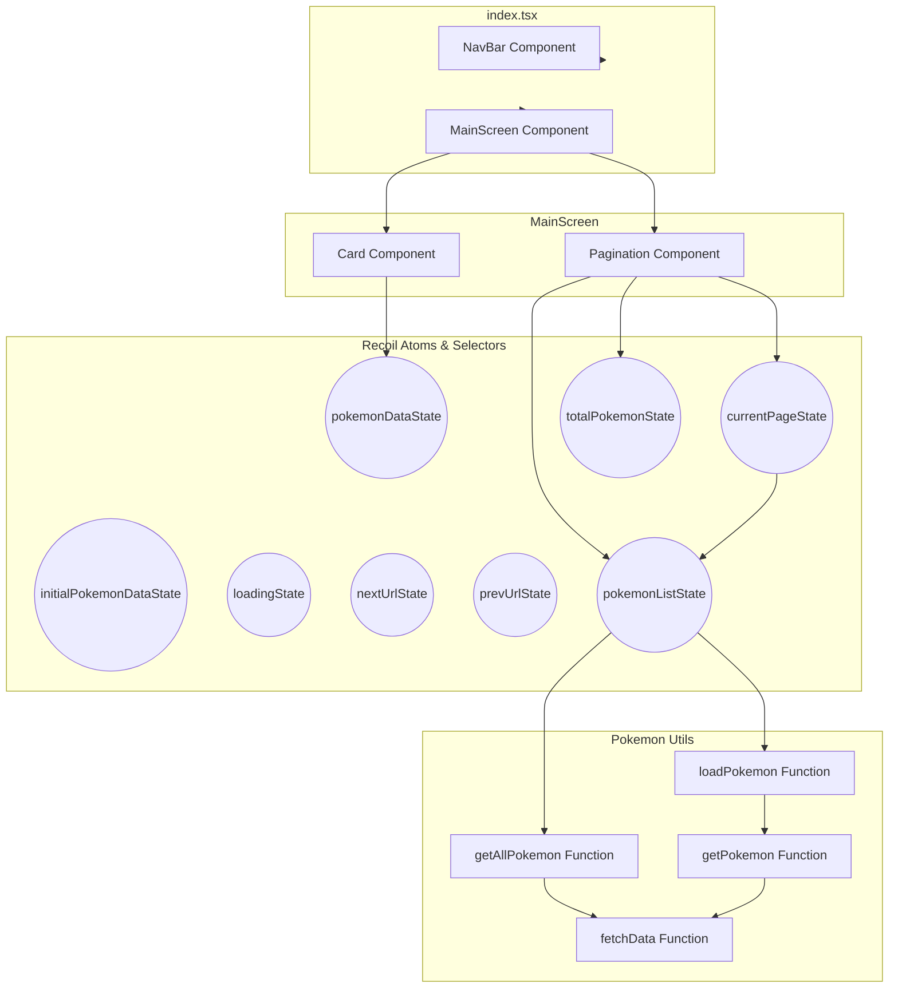

```mermaid

flowchart TD

    subgraph index.tsx
        navBar[NavBar Component]
        mainScreen[MainScreen Component]
    end

    subgraph MainScreen
        cardComp[Card Component]
        pagiComp[Pagination Component]
    end

    subgraph "Recoil Atoms & Selectors"
        initialPokemonDataState((initialPokemonDataState))
        pokemonDataState((pokemonDataState))
        loadingState((loadingState))
        nextUrlState((nextUrlState))
        prevUrlState((prevUrlState))
        currentPageState((currentPageState))
        pokemonListState((pokemonListState))
        totalPokemonState((totalPokemonState))
    end

    subgraph "Pokemon Utils"
        fetchData[fetchData Function]
        getAllPokemon[getAllPokemon Function]
        getPokemon[getPokemon Function]
        loadPokemon[loadPokemon Function]
    end

    index.tsx --> navBar
    index.tsx --> mainScreen

    mainScreen --> cardComp
    mainScreen --> pagiComp

    pagiComp --> currentPageState
    pagiComp --> pokemonListState
    pagiComp --> totalPokemonState

    cardComp --> pokemonDataState

    currentPageState --> pokemonListState

    pokemonListState --> getAllPokemon
    pokemonListState --> loadPokemon

    getAllPokemon --> fetchData
    getPokemon --> fetchData
    loadPokemon --> getPokemon


```
